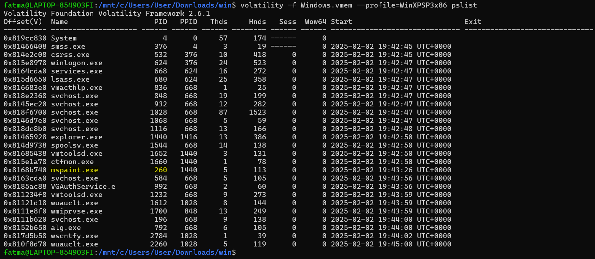
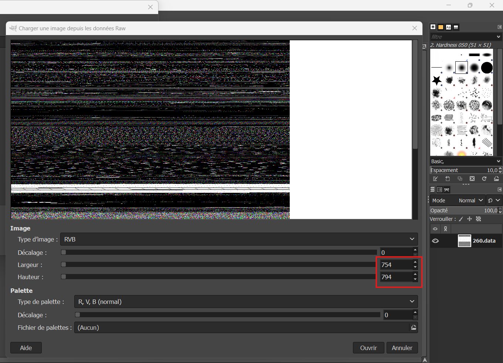
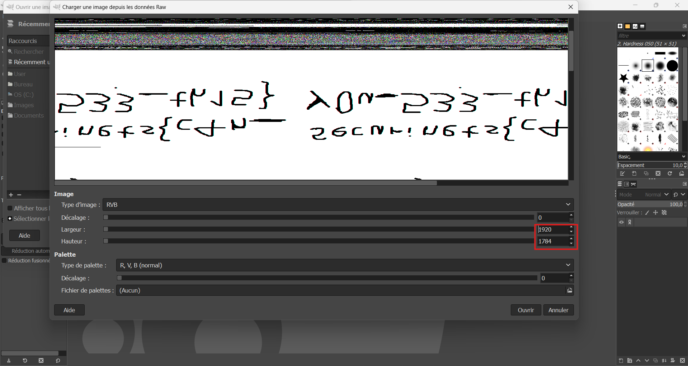
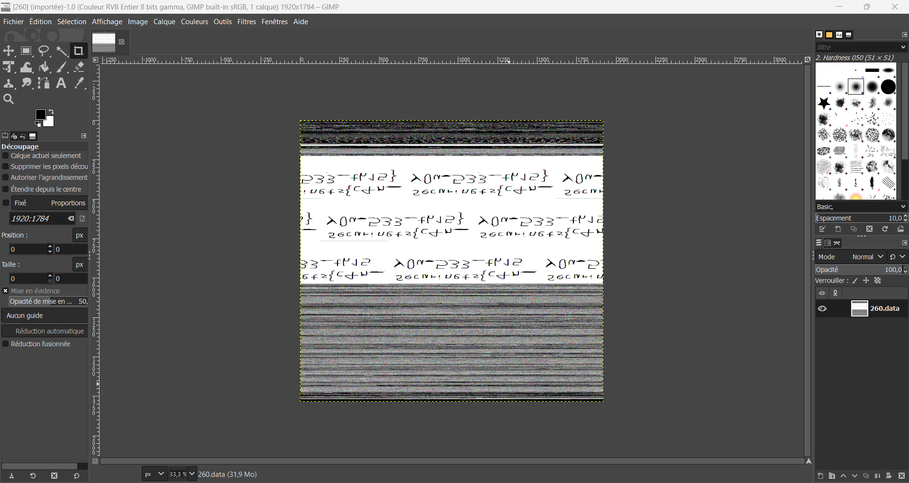
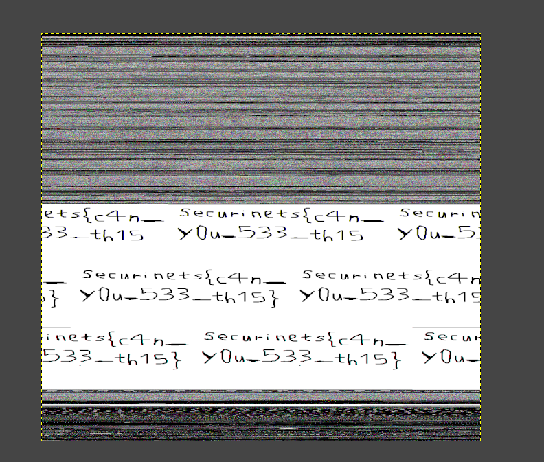

# **Sketchy**

## **Challenge Description**

Some people write their passwords down, others use password managers, but me? I draw them. It’s a foolproof method... until I forget what I drew. Luckily, my computer never truly forgets.

**File:** `Sketchy.7z`
**Flag format:** `Securinets{flag_here}`

**Author:** PetriQore  

---

## **Solution**

**Requirements:** Volatility and GIMP

### **Step 1. Extract the File**

First, extract the contents of the **Sketchy.7z** archive using 7-Zip.

Run the following command:

```bash
7z x Sketchy.7z
```

This will extract the **Windows.vmem** file.

---

### **Step 2. Analyze the Memory Dump**

The file **Windows.vmem** is a memory dump, and we need to analyze it to identify any processes related to drawing or images.
Based on the challenge description, we know that the flag is somehow related to a "drawing."

We’ll use **Volatility** to analyze the memory dump and look for drawing processes, starting with a basic listing of running processes.

#### Run the following command to view the process list:

```bash
volatility -f Windows.vmem --profile=WinXPSP3x86 pslist
```



We find that **mspaint.exe** (Microsoft Paint) is running, and its **PID** is 260.
Since **mspaint** is a program that deals with drawing, it is highly likely that the flag will be related to this process.

---

### **Step 3. Dump the Memory of mspaint.exe**

To get a memory dump of **mspaint**, we use the **memdump** plugin in Volatility.
This will allow us to extract the raw memory of the **mspaint** process, which we can then analyze for any hidden information.

#### Run the following command to dump the memory of the **mspaint** process:

```bash
volatility -f Windows.vmem --profile=WinXPSP3x86 memdump -p 260 -D .
```

This command will create a dump of the **mspaint** process's memory and save it as **260.dmp** in the current directory.

---

### **Step 4. Convert the Memory Dump to a data File**

We now have the raw memory dump of **mspaint.exe** in the file **260.dmp**.
To analyze this memory, we need to convert it into data file.

```bash
mv 260.dmp 260.data
```

---

### **Step 5. Open the File in GIMP**

We open the **260.data** file with **GIMP** (or any image editor that can handle raw data files).
However, upon opening it, we notice some **distortion** or unexpected results.



#### This is normal as the data was not originally intended to be an image, but we can still work with it.

In **GIMP**, we begin adjusting the **height** and **width** of the image file.
We keep modifying these values until something starts to appear on the screen.
We adjust until a **clear pattern** starts to emerge. (Around Height=1784 and Width=1920)



#### We click on Open.



---

### **Step 6. Flip, Rotate, and Refine the Image**

To reveal the flag, we try flipping and rotating the image in GIMP.



---

### **Step 7. Reveal the Flag**

After performing the necessary adjustments, we finally see the flag in the image:

```
Securinets{c4n_y0u_533_th15}
```

---

