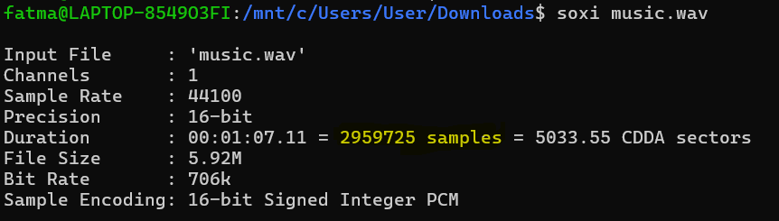
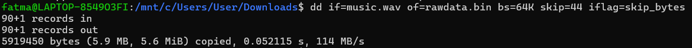
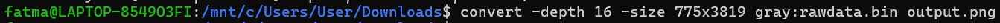
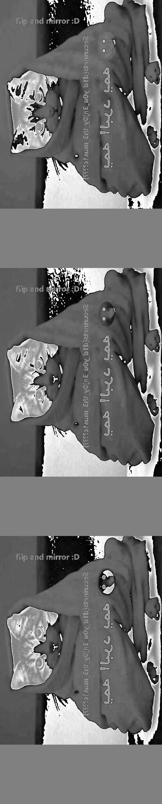
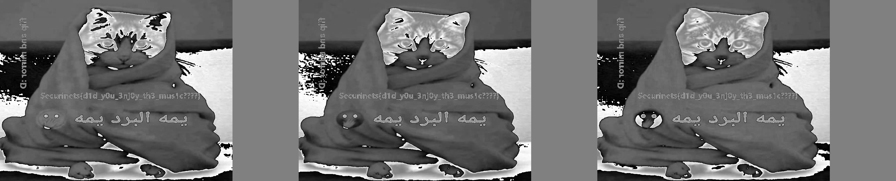

# Pixels&Samples

## Challenge Description
I was so impressed by SSTV transmission that I decided to create a simple image-to-audio conversion method, which I used to hide a secret image. Can you retrieve it?

**File:** `music.wav`  
**Flag format:** `Securinets{flag_here}`  
**Author:** PetriQore

---

## Solution

### Step 1. Inspect WAV File Properties

**Command line:** `soxi music.wav`  
**Requirements:** SoX must be installed (`sudo apt install sox`).



The WAV file contains **2959725 samples** as we see in the command output. 

#### Understanding the Relationship Between Samples and Image Dimensions

Since the audio was converted to raw 16-bit grayscale, each sample corresponds to a single pixel in an image.
To reconstruct the image, we need to find valid dimensions (W × H) that multiply to 2959725 (total samples).

#### Finding Possible Dimensions
Since 2,959,725 = 3 × 5² × 19 × 31 × 67, some possible factor pairs are:

- `775 × 3,819`
- `1,005 × 2,945`
- `1,273 × 2,325`
- `1,425 × 2,077`
- `1,767 × 1,675`

We will try some of these pairs later on for the conversion untill we get the right pair.

### Step 2. Extract Raw PCM Data from WAV File
A WAV file has a 44-byte header. Skip that header to get just the sample data. 

**Command line:** `dd if=music.wav of=rawdata.bin bs=64K skip=44 iflag=skip_bytes`



**What it does:**
  This produces **rawdata.bin** containing the 16-bit PCM samples, that we'll convert to an image. 

**Command line explanation:**
- `bs=64K`: The block size is set to 64KB, which helps speed up the process.
- `skip=44`: Skips the first 44 bytes (the header).
- `iflag=skip_bytes`: This flag ensures the skip of 44 bytes is handled correctly without losing any data.

### Step 3. Convert Raw Data to an Image

**Command line:** `convert -depth 16 -size 775x3819 gray:rawdata.bin output.png`  
**Requirements:** ImageMagick must be installed (`sudo apt install imagemagick`).



**What it does:**
 Converts raw binary image data (`rawdata.bin`) into a viewable image (`output.png`).
 
**Command line explanation:**
- `-depth 16`: Specifies 16-bit grayscale pixels.
- `-size 775x3819`: Defines image width × height (must match total samples).
- `gray:rawdata.bin`: Treats raw data as grayscale pixel values.

### Step 4. Adjust Dimensions If Needed
Check the `output.png` file.  
If the image appears stretched or distorted, try different factor pairs until it looks correct. In this case, `775 × 3819` works. If it didn’t, we would test other pairs.

### Step 5: Retrieving the Flag
After raw data conversion with the right dimensions, we get a black-and-white image flipped and mirrored.



We flip and mirror and get to see the flag.



---

## Flag

```
Securinets{d1d_y0u_3nj0y_th3_mus1c????}
```

---
